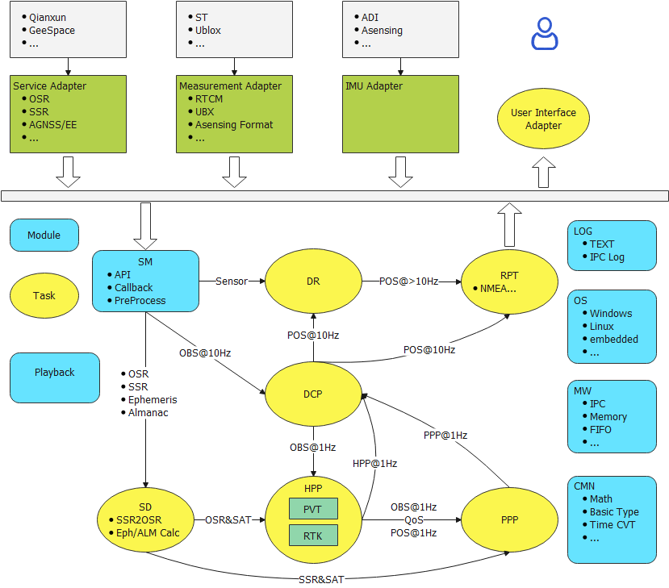
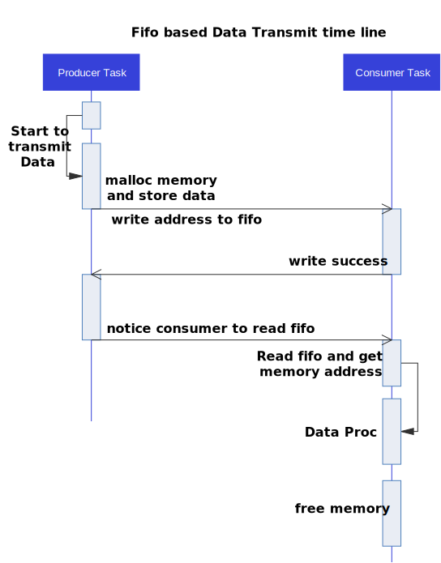
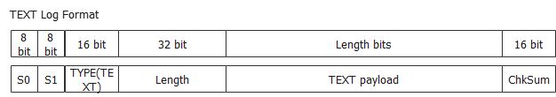
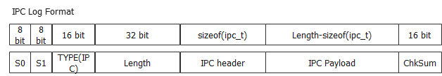

<center><font color=black size=8><b>Location Engine Software Design</b></font></center>




# 概述

Location engine, 为GNSS定位引擎, 包括PVT, RTK, PPP, DCP等模块。

| item | Comment                                                      |      |
| ---- | ------------------------------------------------------------ | ---- |
| SM   | Session Manager 提供用户调用API和即时性的数据预处理，例如解码，格式转换... |      |
| RPT  | Reporter 上报用户需要的数据                                  |      |
| HPP  | High Precision Positioning 包括单点定位(SPP)和地基增强算法(RTK) |      |
| SD   | Satellite Data 卫星端和服务端的数据处理，包含Ephemeris和Almanac计算, SSR, OSR, SSR2OSR |      |
| PPP  | Precision Point Positioning 星基增强算法                     |      |
| DCP  | Different Carrier Phase 历元载波单差                         |      |
| DR   | Dead Reckoning 惯导                                          |      |


# 接口


## 1. SM


## 2. RPT


## 3. SD


## 4. HPP


## 5. PPP


## 6. DCP


## 7. DR


# IPC 

Inter Process commucation(IPC)是基于fifo的生成者-消费者模式数据交互模块，用于实现各个任务之间非阻塞式的数据传递。当发送线程需要传递消息时，首先将数据复制到新的一块动态内存中，并将该内存的地址放入fifo中，然后通知接收线程读取fifo中的数据地址，当接收线程使用完该数据之后，必须释放该内存。



```c++
typedef struct {
  uint8_t   u_version;
  uint8_t   u_src_id;
  uint8_t   u_dst_id;
  uint8_t   u_reserve;
  uint32_t  q_ipc_id;
  uint64_t  t_timestamp_ms;
  uint32_t  q_reserve;
  uint32_t  q_length;
  uint8_t*  p_data;
} ipc_t;
```


# GNSS日志

日志主要分为分为2种, 1. TEXT; 2. IPC

## TEXT




## IPC




# 回归平台

## 算法数据

1. RTCM 观测量 + RTCM差分，不支持AGNSS
2. UBLOX 观测量 + RTCM 差分，不支持AGNSS
3. RINEX观测量 + RINEX差分
4. RTCM 观测量 + RINEX差分

适配当前已有的算法(RTK)


GNSS日志， 需保证数据时序，并且支持外部RINEX差分，RINEX导航电文和外部RTCM差分回放


## Truth

采集时可以使用多种不同设备和格式，数据归档时转换为一种Truth格式。

可能需要提供转换工具开发。


