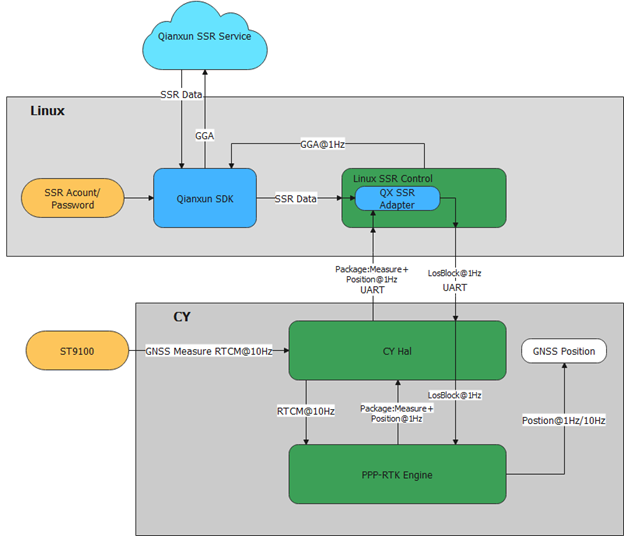

<center><font color=black size=8><b>SSR Linux下发说明文档</b></font></center>




# 上发数据定义

## Linux端千寻qxsi_station_info_t 定义

```c++
/* observation data records number*/
#define QXSI_OBS_DATA_NUM_LIMIT                        (80)
/* max number of channel for one satellite*/
#define QXSI_OBS_SAT_CHL_NUM_LIMIT                     (15)

/* Types of channel */
typedef enum {
    CHANNEL_IDX_HEAD = 0,
    CHANNEL_IDX_C = 1,          /* channel: C */
    CHANNEL_IDX_S = 2,          /* channel: S */
    CHANNEL_IDX_L = 3,          /* channel: L */
    CHANNEL_IDX_X = 4,          /* channel: X */
    CHANNEL_IDX_P = 5,          /* channel: P */
    CHANNEL_IDX_W = 6,          /* channel: W */
    CHANNEL_IDX_Y = 7,          /* channel: Y */
    CHANNEL_IDX_M = 8,          /* channel: M */
    CHANNEL_IDX_N = 9,          /* channel: N */
    CHANNEL_IDX_D = 10,         /* channel: D */
    CHANNEL_IDX_I = 11,         /* channel: I */
    CHANNEL_IDX_Q = 12,         /* channel: Q */
    CHANNEL_IDX_A = 13,         /* channel: A */
    CHANNEL_IDX_B = 14,         /* channel: B */
    CHANNEL_IDX_Z = 15,         /* channel: Z */
    CHANNEL_IDX_E = 16,         /* channel: E */
    CHANNEL_IDX_TAIL = 17,
} qxsi_channel_idx_e;

/* Struct of channel */
typedef struct {
    qxsi_channel_idx_e tag;             /* channel tag */
    int frq;                            /* frequency number */
} qxsi_channel_t;

/* Observation data */
typedef struct {
    double L;                           /* observation data carrier-phase (cycle) */
    double P;                           /* observation data pseudorange (m) */
    double D;                           /* observation data doppler frequency (Hz) */
    int snr;                            /* Signal to Noise Ratio */
    int lli;                            /* lost lock of indicator */
    int signal_strength;                /* signal strength */
} qxsi_obs_data_t;

/* Observation data of one channel */
typedef struct {
    qxsi_channel_t channel;             /* channel */
    qxsi_obs_data_t data;               /* observation data of the channel */
} qxsi_channel_obs_data_t;


/* Satellite id */
typedef struct {
    qxsi_sat_sys_e sys;                 /* satellite system */
    int prn;                            /* satellite index of the system */
} qxsi_sat_id_t;

/* Observation data of one satellite */
typedef struct {
    qxsi_sat_id_t id;                   /* satellite id */
    int num;                            /* channel count of one satellite */
    qxsi_channel_obs_data_t chl_data[QXSI_OBS_SAT_CHL_NUM_LIMIT];  /* all channel data */
} qxsi_sat_meas_data_t;

/* Observation data of one epoch */
typedef struct {
    qxsi_gps_time_t time;               /* the GPS time of the epoch */
    int num;                            /* satellite count */
    qxsi_sat_meas_data_t sat_data[QXSI_OBS_DATA_NUM_LIMIT];      /* observation data of the epoch */
} qxsi_epoch_meas_data_t;

typedef struct {
    double x; /* meter */
    double y; /* meter */
    double z; /* meter */
} qxsi_coor_xyz_t;

/* Station observation and position */
typedef struct {
    qxsi_epoch_meas_data_t obs;         /* current observation data */
    qxsi_coor_xyz_t pos;                /* station init position of current epoch */
} qxsi_station_info_t;

sizeof(qxsi_station_los_t) = 77136
```


## 导远gnss_StationMeasureReport_t定义

```c++
#ifndef __LOC_CORE_REPORT_H_
#define __LOC_CORE_REPORT_H_

#include <stdint.h>

typedef enum {
  LOC_REPORT_ID_NMEA         = (uint16_t)0x0004,
  LOC_REPORT_ID_POS_AND_MEAS = (uint16_t)0x0005,
} loc_ReportMessageIDEnum;
typedef uint16_t loc_ReportMessageIDType;

/* GNSS Measurement structure */
typedef struct {
  uint8_t       u_constellation;         /** Measurement constellation, see gnss_ConstellationEnumType */
  uint8_t       u_svid;                  /** Measurement satellite index of the iteself system */
  uint8_t       u_signal;                /** Measurement signal type, see gnss_SignalType */
  uint8_t       u_LLI;                   /** Loss of lock indicator */
  float         f_cn0;                   /** Carrier-to-noise density */
  double        d_doppler;               /** Doppler */
  double        d_pesudoRange;           /** Pesudo-range */
  double        d_carrierPhase;          /** Carrier phase */
} GnssMeasReport_t;

 /* Station and Measurement Report Struture */
#define VERSION_GNSS_SAT_MEAS_REPORT  (0)
typedef struct {
  uint8_t          u_Version;
  /** w_Size = sizeof(gnss_AggregativePositionMeasureReport_t) + w_MeasCount * sizeof(GnssMeasReport_t) */
  uint16_t         w_Size;
  uint16_t         w_GpsWeek;
  uint32_t         q_GpsTowMsec;
  uint8_t          u_FixStatus;
  double           d_PosLla[3];
  float            f_VelEnu[3];
  float            f_PosXyzUnc[3];
  float            f_VelEnuUnc[3];
  uint16_t         w_MeasCount;
  GnssMeasReport_t z_Meas[0];
} gnss_AggregativePositionMeasureReport_t;

/**
 * @brief Location core report Gnss aggregative position and measurement data as
 *        a serialized buffer to user
 * @param[in]   pz_StationMeasureReport - Aggregative position and measurement data
 * @return      None
 */
void loc_report_AggregativePositionMeasure(gnss_AggregativePositionMeasureReport_t* pz_AggregativePositionMeasureReport);

/* Nmea Message Report Structure */
typedef struct {
  uint8_t gga[128];
  uint8_t rmc[128];
} gnss_NmeaMessageReport_t;

/**
 * @brief Location core report NMEA Message to user
 * @param[in]   gnss_NmeaMessageReport_t - NMEA Message strings
 * @return      None
 */
void loc_report_NmeaMessage(gnss_NmeaMessageReport_t* pz_NmeaMessageReport);

#endif
```


# 传输协议

| **1 Byte** | **1 Byte** | **2 Bytes** | **4 Bytes** | **Length Bytes** | **1 Byte** | **1 Byte** |
| ---------- | ---------- | ----------- | ----------- | ---------------- | ---------- | ---------- |
| SYNC0      | SYNC1      | ID          | Length      | Payload          | CK_A       | CK_B       |
| 0x41       | 0x53       |             |             |                  |            |            |

```
void log_checksum(uint8_t* data, uint32_t len, uint8_t* ck0, uint8_t* ck1)
{
  uint8_t CK[2] = { *ck0, *ck1 };

  for (uint32_t i = 0; i < len; i++)
  {
    CK[0] = CK[0] + data[i];
    CK[1] = CK[1] + CK[0];
  }

  *ck0 = CK[0];
  *ck1 = CK[1];
  return;
}
```

**[CK_A, CK_B]=checksum(Id||length ||Version||Payload)**

# gnss_StationMeasureReport_t Payload

| 项目 | Value  |
| ---- | ------ |
| ID   | 0x0004 |


| Byte Offset          | Name            | Format     | Length     | Unit     |
| -------------------- | --------------- | ---------- | ---------- | -------- |
| 0                    | SYNC0/0x41      | uint8_t    | 1          |          |
| 1                    | SYNC1/0x53      | uint8_t    | 1          |          |
| 2                    | ID              | uint16_t   | 2          |          |
| 4                    | Payload  Length | uint32_t   | 4          |          |
| 8                    | u_Version       | uint8_t    | 1          | -        |
| 9                    | w_Size          | uint16_t   | 2          | -        |
| 11                   | w_GpsWeek       | uint16_t   | 2          | week     |
| 13                   | q_GpsTowMsec    | uint16_t   | 4          | ms       |
| 17                   | u_FixStatus     | uint8_t    | 1          |          |
| 18                   | Lat             | int64_t    | 8          | deg      |
| 26                   | Lon             | int64_t    | 8          | deg      |
| 34                   | Alt             | int64_t    | 8          | meter    |
| 42                   | Vel E           | int32_t    | 4          | m/s      |
| 46                   | Vel N           | int32_t    | 4          | m/s      |
| 50                   | Vel U           | int32_t    | 4          | m/s      |
| 54                   | Ecef X Unc      | int32_t    | 4          | deg      |
| 58                   | Ecef Y Unc      | int32_t    | 4          | deg      |
| 62                   | Ecef Z Unc      | int32_t    | 4          | m        |
| 66                   | Vel E Unc       | int32_t    | 4          | m/s      |
| 70                   | Vel N Unc       | int32_t    | 4          | m/s      |
| 74                   | Vel U Unc       | int32_t    | 4          | m/s      |
| 78                   | w_MeasCount     | uint16_t   | 2          | -        |
| 80                   | Meas[1]         |            | 32         | -        |
| 80+32                | Meas[2]         |            | 32         |          |
| …                    |                 |            |            |          |
| 80 + w_MeasCount* 32 | In total        |            |            |          |
|                      |                 |            |            |          |
|                      |                 |            |            |          |
| **gnss_MeasPayload** |                 |            |            |          |
| **Byte Offset**      | **Name**        | **Format** | **Length** | **Unit** |
| 0                    | u_constellation | uint8_t    | 1          | -        |
| 1                    | u_svid          | uint8_t    | 1          | -        |
| 2                    | u_signal        | uint8_t    | 1          | -        |
| 3                    | u_LLI           | uint8_t    | 1          | -        |
| 4                    | cn0             | uint8_t    | 4          | dbm      |
| 8                    | d_doppler       | int64_t    | 8          | m/s      |
| 16                   | d_pesudoRange   | int64_t    | 8          | m        |
| 24                   | d_carrierPhase  | int64_t    | 8          | cycles   |
| 32                   | In total        |            |            |          |


# 下发数据定义

千寻adapter输出的结构体 

```c++
// qxsi_ssr2los_type_def.h
/* Line of sight data of station */
typedef struct {
    qxsi_gps_time_t obs_time;           /* observation time */
    qxsi_gps_time_t stec_time;          /* STEC correction data time */
    qxsi_gps_time_t std_time;           /* STD correction data time */
    qxsi_gps_time_t ztd_corr_time;      /* ZTD correction data time */
    qxsi_ssr_atmo_mask ztd_mask;        /* flag of ZTD corrected indicator */
    qxsi_ssr_site_error_model_mask site_error_model_mask;/* flag of error model indicator for site*/
    unsigned char sat_num;              /* satellite number of current epoch */
    qxsi_ztd_corr_data_t ztd;           /* correction for the ZTD SSR data */
    qxsi_sat_los_t sat_los_corr[QXSI_OBS_DATA_NUM_LIMIT];       /* all satellite correction data for current epoch */
} qxsi_station_los_t;
```

导远需要使用并下发结构体

```c++

/* Line of sight data of one satellite */
typedef struct {
  uint8_t                u_constellation;   /* see gnss_ConstellationEnumType */
  uint8_t                u_svid;            /* satellite index of the system */
  gnss_ssrSatOrbClkMask  u_orbClkMask;      /* flag of satellite orbit or clock corrected indicator */
  gnss_ssrAtmoMask       u_atmoMask;        /* flag of atmosphere corrected indicator */
  gnss_ssrSatErrorModelMask u_windUpMask;      /* flag of satellite wind up corrected indicator */
  uint8_t                u_signalNum;       /* signal number of one satellite */
  int32_t                q_iode;            /* ephemeris iode */
  gnss_SatPosVelClk_t    z_satPosVelClkBrdc;/* satellite information of ephemeris calculated, for example, satellite position/velocity/clock/clock drift,etc. */
  gnss_SsrCorrBias_t     z_orbClk;          /* correction for the orbit/clock SSR data */
  GpsTime_t              z_orbClkTime;      /* correction data time for the orbit/clock SSR data */
  gnss_SsrCorrBias_t     z_stec;            /* correction for the STEC SSR data */
  gnss_SsrCorrBias_t     z_std;             /* correction for the STD SSR data */
  double                 d_windUp;          /* correction of satellite wind up */
  float                  f_yaw;             /* yaw angle of satellite, unit in degree */
  float                  f_yawRate;         /* yaw rate of satellite, unit in degree per second */
  gnss_SignalCorr_t      z_signalBiasCorr[GNSS_SSR_SAT_CHL_NUM_LIMIT];/* all signal data for one satellite */
} gnss_satSsrLos_t;

/* Line of sight data of station */
typedef struct {
  GpsTime_t              z_tor;           /* observation time */
  GpsTime_t              z_STECtime;      /* STEC correction data time */
  GpsTime_t              z_STDtime;       /* STD correction data time */
  GpsTime_t              z_ZTDtime;       /* ZTD correction data time */
  gnss_ssrAtmoMask       u_ZTDmask;       /* flag of ZTD corrected indicator */
  gnss_ssrErrorModelMask u_errorModelMask;/* flag of error model corrected indicator */
  gnss_ZtdCorrData_t     z_ZTDcorr;       /* correction for the ZTD SSR data */
  uint8_t                u_satCount;      /* satellite count */
  gnss_satSsrLos_t       z_satLosCorr[GNSS_SSR_SAT_NUM_LIMIT];/* all satellite correction data for current epoch */
} gnss_epochSsrLos_t;

#define VERSION_GNSS_SSR_LOS_BLOCK  (1)
typedef struct {
  uint8_t                u_version;
  uint16_t               w_size;
  double                 d_siteCoor[3];  /* the site initial position of current epoch*/
  gnss_epochSsrLos_t     z_epochLosInfo; /* observation LOS of SSR data for current epoch */
} gnss_ssrLosBlock_t;
```

千寻定义结构与导远定义结构体转换

```c++
qxsi_station_los_t -> gnss_ssrLosBlock_t
/**
 * @brief Convert SSR los from qxsi to asensing
 * @param[in] pz_qxsi_los - Qxsi SSR los data
 * @param[in] pz_ag_los - Asensing SSR los data
 * @return    Satellite Number
 */
uint8_t ssr_cvt_SsrLosBlk_Qxwz2Ag(const qxsi_station_los_t* pz_qxsi_los,
  gnss_ssrLosBlock_t* pz_ag_los)
```


gnss_ssrLosBlock_t 数据包组包函数

```c++
uint8_t* mem_AllocSsrLosBlockBuffer(
  gnss_ssrLosBlock_t* pz_SsrLosBlock,
  uint32_t* pq_buffer_size);

// 调用方式

uint32_t q_data_size;
uint8_t* p_data = mem_AllocSsrLosBlockBuffer(pz_SsrLosBlock, &q_data_size);
// send p_data to MCU
OS_FREE(p_data);
```


数据注入Location Engine 接口

```
/**
 * @brief     Inject SSR Correction stream
 * @param[in] data - stream data buffer
 * @param[in] len - stream data length
 * @param[in] source - stream data service source
 * @return    None
 */
 
gnss_ssrServiceSource = GNSS_SSR_SERVICE_SOURCE_AG_SRR_LOS;
 
void loc_api_InjectSsrStream(uint8_t* data, uint32_t len, gnss_ssrServiceSource source);

```

